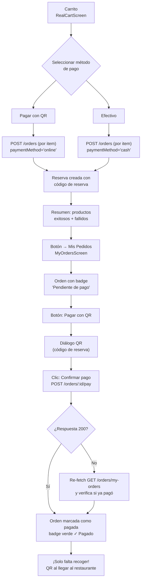
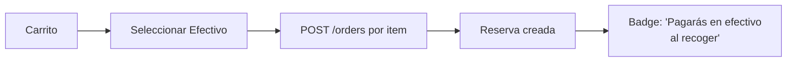

# Eco Bocado — Reducción de Desperdicio de Alimentos

App Flutter para conectar restaurantes con clientes a través de ofertas de última hora.

## Flujo de Pago: Carrito → QR → Mis Pedidos



### Flujo en efectivo (simplificado)



## Requisitos

- Flutter SDK `^3.11.3`
- Dart SDK `>=3.11.0`
- Backend: `https://reduccion-desperdicio-backend.vercel.app`

## Comandos

```bash
flutter pub get
flutter run
flutter analyze
flutter test
```

## Comandos Específicos

| Comando | Descripción |
|---|---|
| `flutter pub run flutter_launcher_icons:main` | Generar iconos de lanzador |
| `flutter analyze && flutter test` | Verificación completa (lint + tests) |

## Estructura del Proyecto

```
lib/
├── main.dart                     # Entrypoint
├── core/                         # Infraestructura global
│   ├── theme/                    # Colores, estilos
│   ├── constants/                # API endpoints
│   └── services/                 # Servicios compartidos
├── features/                     # Módulos por funcionalidad
│   ├── auth/                     # Login, registro, perfil
│   ├── home/                     # Menú, tienda, carrito, perfil cliente
│   ├── dashboard/                # Panel del comerciante
│   ├── orders/                   # Pedidos (cliente + comerciante)
│   ├── restaurant_detail/        # Detalle de restaurante
│   └── map/                      # Mapa con filtros
├── shared/                       # Widgets reutilizables
└── routes/                       # Definición de rutas
```

Ultima version de la APK