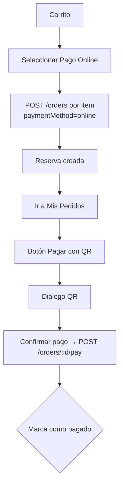
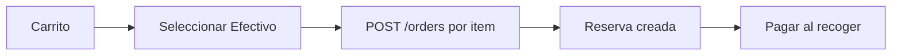

# Eco Bocado — Reducción de Desperdicio de Alimentos

App Flutter para conectar restaurantes con clientes a través de ofertas de última hora.
Backend: `https://reduccion-desperdicio-backend.vercel.app`

---

## Índice

1. [Requisitos previos](#1-requisitos-previos)
2. [Clonar el repositorio](#2-clonar-el-repositorio)
3. [Instalar dependencias](#3-instalar-dependencias)
4. [Configuración](#4-configuración)
5. [Ejecutar la app](#5-ejecutar-la-app)
6. [Verificación (lint + tests)](#6-verificación-lint--tests)
7. [Generar iconos de lanzador](#7-generar-iconos-de-lanzador)
8. [Compilar APK / Release](#8-compilar-apk--release)
9. [Flujo de pago](#9-flujo-de-pago)
10. [Estructura del proyecto](#10-estructura-del-proyecto)
11. [Dependencias y librerías](#11-dependencias-y-librerías)
12. [Archivos de configuración](#12-archivos-de-configuración)

---

## 1. Requisitos previos

| Herramienta | Versión | Descarga |
|---|---|---|
| **Flutter SDK** | `^3.11.3` | https://docs.flutter.dev/get-started/install |
| **Dart SDK** | `>=3.11.0` | Incluido con Flutter |
| **Git** | cualquier versión | https://git-scm.com/downloads |
| **Editor** | VS Code / Android Studio | Con extensión Flutter y Dart |

Verifica la instalación:

```bash
flutter doctor
```

Debe mostrar todas las casillas verdes (o al menos las necesarias para tu plataforma de desarrollo).

---

## 2. Clonar el repositorio

```bash
git clone <url-del-repositorio>
cd reduccion_desperdicio_alimentos
```

---

## 3. Instalar dependencias

```bash
flutter pub get
```

Esto descarga todas las dependencias declaradas en `pubspec.yaml` y genera el archivo `pubspec.lock`.

---

## 4. Configuración

El proyecto **no requiere** variables de entorno ni archivos de configuración adicionales.

- **URL del backend**: Hardcodeada en `lib/core/constants/api_constants.dart` → `ApiConstants.baseUrl`
- **Cloudinary** (subida de imágenes): `cloudName=dl4qmorch`, `preset=ecobocado`, `folder=productos` — hardcodeados
- **Mapas**: OpenStreetMap (gratuito, sin API key)
- **Notificaciones**: locales (no requieren servicios externos)

Si necesitas cambiar la URL del backend, edita el archivo:

```dart
// lib/core/constants/api_constants.dart
class ApiConstants {
  static const String baseUrl = 'https://reduccion-desperdicio-backend.vercel.app';
}
```

---

## 5. Ejecutar la app

```bash
flutter run
```

Selecciona el dispositivo disponible (emulador Android, iOS simulator, o dispositivo físico conectado).

Para ejecutar en un dispositivo específico:

```bash
flutter devices                  # Listar dispositivos disponibles
flutter run -d <device-id>       # Ejecutar en dispositivo específico
```

La app inicia en la pantalla de login. Puedes registrar un usuario cliente o comerciante.

---

## 6. Verificación (lint + tests)

```bash
flutter analyze && flutter test
```

- **`flutter analyze`**: análisis estático de código (lints y type-checking)
- **`flutter test`**: ejecuta los tests (1 smoke test en `test/widget_test.dart`)

---

## 7. Generar iconos de lanzador

```bash
flutter pub run flutter_launcher_icons:main
```

Genera el ícono de la app en Android desde `assets/images/logo.jpeg`. Configuración en `pubspec.yaml` (sección `flutter_launcher_icons`).

---

## 8. Compilar APK / Release

### Android APK (debug)

```bash
flutter build apk --debug
```

### Android APK (release)

```bash
flutter build apk --release
```

### Android App Bundle (Play Store)

```bash
flutter build appbundle
```

### iOS (solo macOS)

```bash
flutter build ios --release
```

Los archivos generados quedan en:
- Android: `build/app/outputs/flutter-apk/`
- iOS: `build/ios/ipa/`

---

## 9. Flujo de pago

### Online (QR)



### Efectivo



---

## 10. Estructura del proyecto

```
lib/
├── main.dart                     # Punto de entrada
├── core/                         # Infraestructura global
│   ├── theme/                    # Colores, estilos
│   ├── constants/                # API endpoints
│   └── services/                 # Servicios compartidos
├── features/                     # Módulos por funcionalidad
│   ├── auth/                     # Login, registro, perfil
│   ├── home/                     # Menú, tienda, carrito, perfil cliente
│   ├── dashboard/                # Panel del comerciante
│   ├── orders/                   # Pedidos (cliente + comerciante)
│   ├── restaurant_detail/        # Detalle de restaurante
│   ├── map/                      # Mapa con filtros
│   └── settings/                 # Configuración de notificaciones
├── shared/                       # Widgets reutilizables
└── routes/                       # Definición de rutas

api/                              # Referencias backend (archivos .http)
assets/images/                    # Logo e imágenes
test/                             # Tests
```

---

## 11. Dependencias y librerías

### Runtime

| Paquete | Versión | Propósito |
|---|---|---|
| `flutter` | SDK | Framework base |
| `cupertino_icons` | ^1.0.8 | Iconos iOS |
| `http` | ^1.6.0 | Peticiones HTTP a la API REST |
| `shared_preferences` | ^2.5.5 | Persistencia local (auth, carrito, favoritos) |
| `image_picker` | ^1.1.2 | Selección de imágenes |
| `http_parser` | ^4.1.2 | Parseo de cabeceras HTTP |
| `mime` | ^2.0.0 | Detección de tipos MIME |
| `flutter_map` | ^8.3.0 | Mapas OpenStreetMap |
| `latlong2` | ^0.9.1 | Coordenadas geográficas |
| `geolocator` | ^14.0.2 | Geolocalización del dispositivo |
| `url_launcher` | ^6.3.1 | Abrir Google Maps desde la app |
| `qr_flutter` | ^4.1.0 | Generación de códigos QR |
| `flutter_local_notifications` | ^18.0.1 | Notificaciones locales push |
| `fl_chart` | ^0.70.2 | Gráficos estadísticos |

### Dev

| Paquete | Versión | Propósito |
|---|---|---|
| `flutter_test` | SDK | Tests unitarios y de widgets |
| `flutter_lints` | ^6.0.0 | Reglas de lint recomendadas |
| `flutter_launcher_icons` | ^0.14.3 | Generación de iconos |

---

## 12. Archivos de configuración

| Archivo | Descripción |
|---|---|
| `pubspec.yaml` | Nombre, versión, SDK, dependencias, assets, launcher icons |
| `analysis_options.yaml` | Reglas de lint (hereda de `flutter_lints`) |
| `pubspec.lock` | Versiones exactas de dependencias (generado automáticamente) |
| `devtools_options.yaml` | Opciones del depurador Flutter DevTools |

---

Última versión de la APK